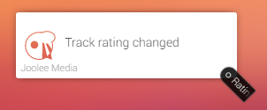

# MusicBee Remote
Ok Homey! Play me something.

Control MusicBee with your Homey! This plugin allows you to send commands through the [MusicBee Remote plugin by Kelsos](http://kelsos.net/musicbeeremote/). Uses devices so you can control multiple MusicBee instances.

## You can:
* Get track information such as artist, album, title, lysics and more
* Play/Pause/Stop music
* Stop music while finishing the current track
 * And trigger when this happened
* Play Next / Previous track
* Change volume
* Toggle repeat
* Toggle shuffle and Auto DJ
* Change track rating

## You can not yet:
* Start playlists
* Get album art (through Base64 string or url)
* Seek in track

## I might add, if people actually use this app:
* Search, queue and start tracks, artists and albums
* Start music from url's
* Transfer playlist content to variable or Homey playlist system
* Trigger with track progress tags (so you can run your own timers with the Countdown app)

# Flow cards explained
## Triggers

Triggers when track changes automatically or by skipping to the next track
* Track title
* Artist name
* Album name
* Album year
* Rating from 0-5 in 10 steps
* Track lyrics
* Track length in seconds

Triggers when playback has been paused, stopped or started
* State
 * Can be 'Playing', 'Paused' or 'Stopped'
 
 

Triggers when track rating has been changed
* Rating from 0-5 in 10 steps

Triggers when MusicBee volume has been changed (combines volume changes that happen less then 500ms appart)
* Volume from 0-100

Triggers when the MusicBee shuffle setting is changed
* State
 * Can be 'shuffle', 'off' or 'autodj'

 

Triggers when Mute is enabled or disabled. Also triggers when volume equals zero
* State
 * Can be 'true' or 'false'
 
 

Triggers when MusicBee repeat setting is changed
* State
 * Can be 'All', 'One' or 'None'

 

Triggers when Homey gets connected or disconnected to MusicBee (e.g. you started or close MusicBee)

A special trigger card.
Triggers when the 'Stop after current track' *action card* did his work. Triggers immediately when playback state is 'Paused' or 'Stopped' when the action card is execured.
Note: This card does not get triggered by the 'stop after current track' option in *MusicBee itself*!

## Condition cards

Whether Homey has an active connection to MusicBee at the moment

## Action cards

Stop playback but finish currently playing track first. Plays together with the 'stopped after current track' trigger card.
Changing playback position in a track or changing track is considired. After the new track is finished, playback will still stop.
To cancel this state, execute the 'Play' action card. Hitting 'Play' in MusicBee or the MusicBee Remote Android app does not cancel this state!
Note: Does not touch the 'stop after current track' option in *MusicBee itself*! They might bite :)

The MusicBee Remote plugin currently does not support setting repeat to 'One'.

# Changelog

V1.0 - 2016-10-20
* Enjoy :)

